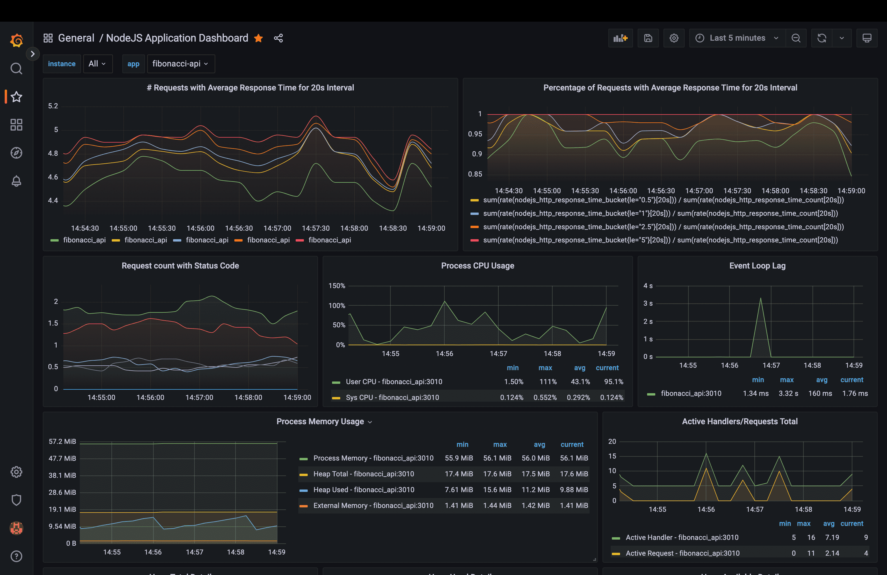

# Prometheus and Grafana for monitoring



## Install Prometheus

```
docker run \        
    -p 9090:9090 \
    -v ./prometheus.yml:/etc/prometheus/prometheus.yml \
    prom/prometheus

```

Prometheus should be up and running on http://localhost:9090

Find more here: https://prometheus.io/docs/prometheus/latest/installation/

## Install Graphana

```
docker run -d --name=grafana -p 3030:3000 grafana/grafana-enterprise
```

The default username:password is admin:admin.
Grafana should be available at http://localhost:3030

Find more here: https://grafana.com/docs/grafana/latest/setup-grafana/configure-docker/  
More useful docs for using with docker-compose:  
https://grafana.com/docs/grafana-cloud/quickstart/docker-compose-linux/  

## Note:  
> The above two steps can be replaced using `docker-compose up -d`.


### Adding Prometheus as data source

Find the IP address of the prometheus container.
Then go to add a data source, add the URL `http://<IP Address>:9090` (e.g., `http:170.30.0.0:9090`)

When using `docker-compose`, we can use static address: `http://prometheus:9090`


# Setup Server

Integrate prom-client in your nodejs project using the documentation here:  
https://grafana.com/docs/grafana-cloud/data-configuration/integrations/integration-reference/integration-nodejs/  
https://github.com/siimon/prom-client  

We can import a pre-built dashboard for nodejs processed from here:  
https://grafana.com/grafana/dashboards/11159-nodejs-application-dashboard/  

You can also find the JSON Model for the dashboard at `server/nodejs-dashboard`.